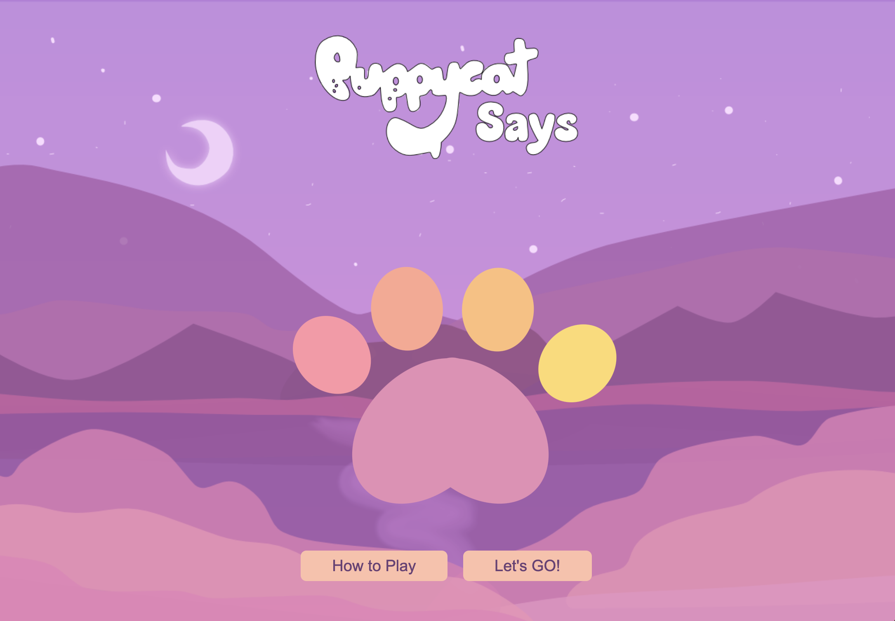
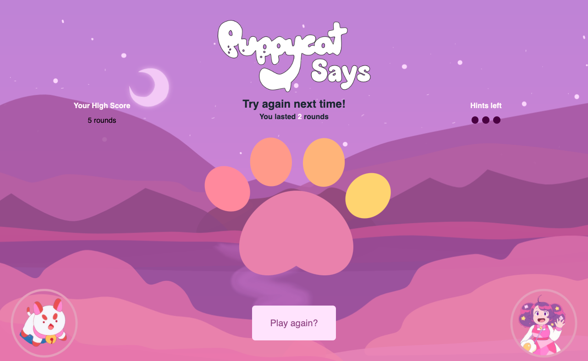

# PuppyCat Says

This is a Simon Says game with a theme inspired by the Netflix series *Bee and PuppyCat*. A sequence of PuppyCat noises play that the player then needs to match by either clicking on the appropriate Toe Bean or by using the corresponding keys (1-4). Each round another sound will be added to the series, until the player can no longer match it.

## Screenshots

## How to Win

PuppyCat can kind of be a jerk, so there is no true "win" scenario. However, a player can do *well* by matching the order of noises PuppyCat makes for as many rounds as possible!

## Technologies Used

- JavaScript
- HTML
- CSS
- Flexbox
- VS Code
- Github
- SVG
- Adobe Illustrator

## Getting Started

[Click to Play PuppyCat Says!](https://stephaniestralina.github.io/SimonSays/)

<u>How to Play</u>

1. Click the 'How to Play" button if you're unfamiliar with how to play Simon Says
2. Click the "Let's GO!" button to start the game -
    - A series of 3 sounds will play (with lights to show which button makes which sound).
3. The player should select the pawprints corresponding with the sounds/lights that were played by PuppyCat in the same order.
4. If the player selects the correct paw prints - they advance to the next round!

# Next Steps

- Implement hints (3 max)
- Implement high score
- Create multiple computer character profiles and backgrounds to choose from